# 【第4章】服务配置篇
::: warning 注意

若在安装过程中产生任何疑问均可[添加官方反馈群629574472](https://jq.qq.com/?_wv=1027&k=sHPbCRAd)获取帮助

:::

## 4.1 python与vscode安装时的注意事项

::: warning 注意

安装时请**务必**注意本章节内容

:::

1. python安装时 **务必勾选** 下图中的复选框，之后**直接点击** `Install Now`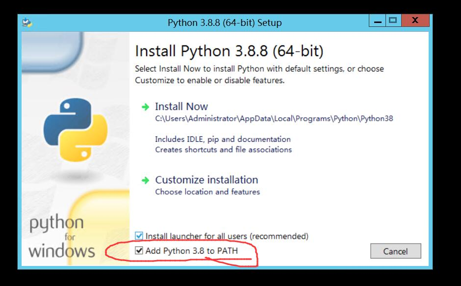
2. vscode安装时 **务必勾选** 下图中的复选框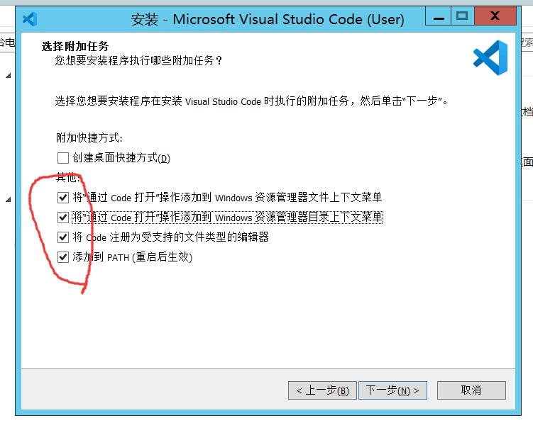

## 4.2 go-cqhttp配置

::: warning 注意

go-cqhttp并非是本项目的产物，仅仅是推荐的稳定的QQbot客户端，若产生的问题与本项目无关，可以查看 [go-cqhttp项目](https://github.com/Mrs4s/go-cqhttp) 获取帮助

:::
1. 打开go-cqhttp文件夹，直接双击打开 `go-cqhttp-v0.9.40-fix4-windows-amd64.exe` ，你将会看到如下画面，等待自动关闭
    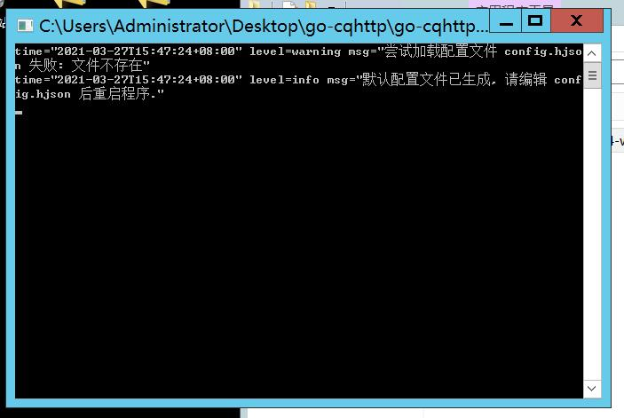

2. 右键生成的 `config.hjson` 文件，选择 `通过 Code 打开` 

3. **完全复制**下方示例代码，**完全覆盖**掉 `config.hjson` 里的内容，再**修改**高亮的代码段，更改为**自己小号的账号和密码**，之后按下 `ctrl+S` 组合键保存，看到上方白点消失即为保存成功，保存成功后关闭此页面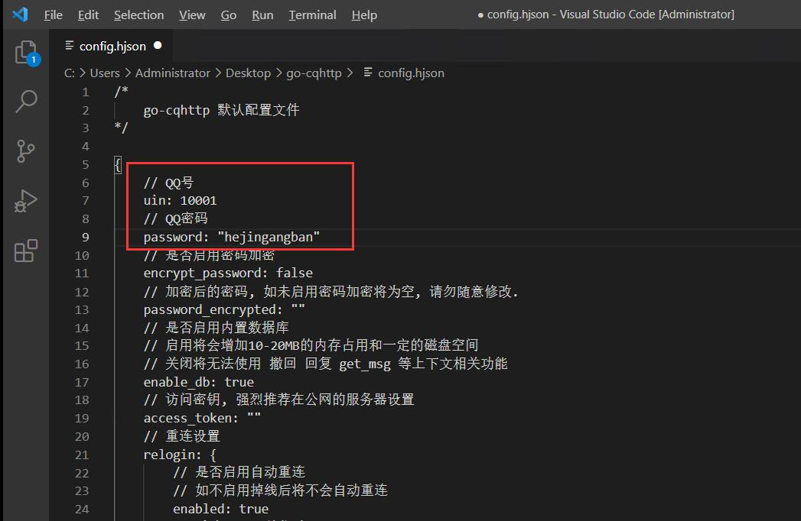

  ::: details 示例代码
  ```hjson {7,9}
  /*
      go-cqhttp 默认配置文件
  */

  {
      // QQ号
      uin: 0
      // QQ密码
      password: ""
      // 是否启用密码加密
      encrypt_password: false
      // 加密后的密码, 如未启用密码加密将为空, 请勿随意修改.
      password_encrypted: ""
      // 是否启用内置数据库
      // 启用将会增加10-20MB的内存占用和一定的磁盘空间
      // 关闭将无法使用 撤回 回复 get_msg 等上下文相关功能
      enable_db: true
      // 访问密钥, 强烈推荐在公网的服务器设置
      access_token: ""
      // 重连设置
      relogin: {
          // 是否启用自动重连
          // 如不启用掉线后将不会自动重连
          enabled: true
          // 重连延迟, 单位秒
          relogin_delay: 3
          // 最大重连次数, 0为无限制
          max_relogin_times: 0
      }
      // API限速设置
      // 该设置为全局生效
      // 原 cqhttp 虽然启用了 rate_limit 后缀, 但是基本没插件适配
      // 目前该限速设置为令牌桶算法, 请参考: 
      // https://baike.baidu.com/item/%E4%BB%A4%E7%89%8C%E6%A1%B6%E7%AE%97%E6%B3%95/6597000?fr=aladdin
      _rate_limit: {
          // 是否启用限速
          enabled: false
          // 令牌回复频率, 单位秒
          frequency: 1
          // 令牌桶大小
          bucket_size: 1
      }
      // 是否忽略无效的CQ码
      // 如果为假将原样发送
      ignore_invalid_cqcode: false
      // 是否强制分片发送消息
      // 分片发送将会带来更快的速度
      // 但是兼容性会有些问题
      force_fragmented: true
      // 心跳频率, 单位秒
      // -1 为关闭心跳
      heartbeat_interval: 0
      // HTTP设置
      http_config: {
          // 是否启用正向HTTP服务器
          enabled: false
          // 服务端监听地址
          host: 0.0.0.0
          // 服务端监听端口
          port: 5700
          // 反向HTTP超时时间, 单位秒
          // 最小值为5，小于5将会忽略本项设置
          timeout: 0
          // 反向HTTP POST地址列表
          // 格式: 
          // {
          //    地址: secret
          // }
          post_urls: {}
      }
      // 正向WS设置
      ws_config: {
          // 是否启用正向WS服务器
          enabled: false
          // 正向WS服务器监听地址
          host: 0.0.0.0
          // 正向WS服务器监听端口
          port: 6700
      }
      // 反向WS设置
      ws_reverse_servers: [
          // 可以添加多个反向WS推送
          {
              // 是否启用该推送
              enabled: true
              // 反向WS Universal 地址
              // 注意 设置了此项地址后下面两项将会被忽略
              // 留空请使用 ""
              reverse_url: ws://127.0.0.1:8080/cqhttp/ws
              // 反向WS API 地址
              reverse_api_url: ""
              // 反向WS Event 地址
              reverse_event_url: ""
              reverse_reconnect_interval: 3000
          }
      ]
      // 上报数据类型
      // 可选: string array
      post_message_format: array
      // 是否使用服务器下发的新地址进行重连
      // 注意, 此设置可能导致在海外服务器上连接情况更差
      use_sso_address: false
      // 是否启用 DEBUG
      debug: false
      // 日志等级 trace,debug,info,warn,error
      log_level: "info"
      // WebUi 设置
      web_ui: {
          // 是否启用 WebUi
          enabled: false
          // 监听地址
          host: 127.0.0.1
          // 监听端口
          web_ui_port: 9999
          // 是否接收来自web的输入
          web_input: false
      }
  }
  ```
  :::

4. 再次双击打开 `go-cqhttp-v0.9.40-fix4-windows-amd64.exe` ，此时会弹出10s后启动的提示，接下来若是出现需要验证码等相关问题请阅读 [go-cqhttp 文档](https://docs.go-cqhttp.org/faq/slider.html)

   ::: details 不会复制框内的内容？

   1. 右键 `go-cqhttp` 窗口顶部，选择 `属性` 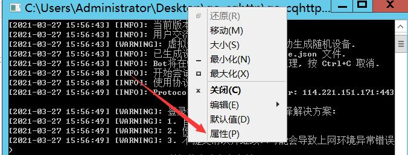
   2. 确保 `快速编辑模式` 已经勾选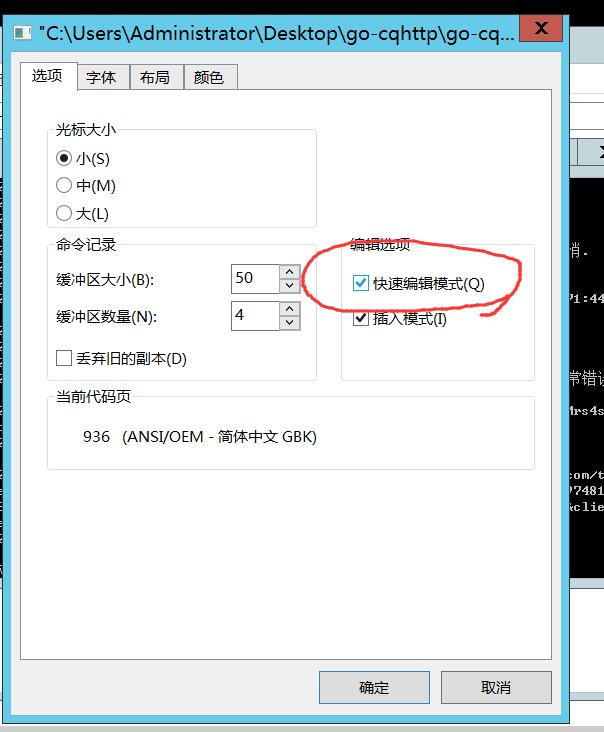
   3. cmd窗口只能进行**矩形**的框选 所以务必从左上角框到右下角，之后在go-cqhttp窗口内点击**鼠标右键**即可复制，在**自己的电脑**上粘贴下来，处理掉多余字符后即可访问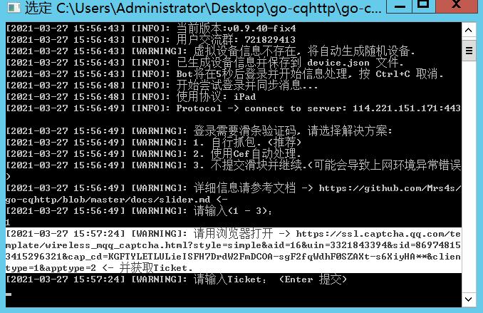

   :::

5. 当所有验证码都验证成功后，go-cqhttp会自动进行登录尝试，当你看到如下提醒时，go-cqhttp就已经正确的配置好并登录上了，注意**不要关闭此窗口**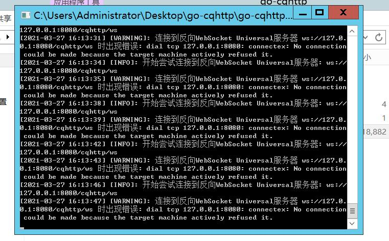

6. 以后每次启动go-cqhttp只需要再次双击打开即可

## 4.3 haruka-bot配置

1. 打开haruka-bot文件夹，点击左上角的 `文件` ，鼠标挪到 `打开 Windows PowerShell` 选项上，选择右侧出现的 `以管理员身份打开 Windows PowerShell`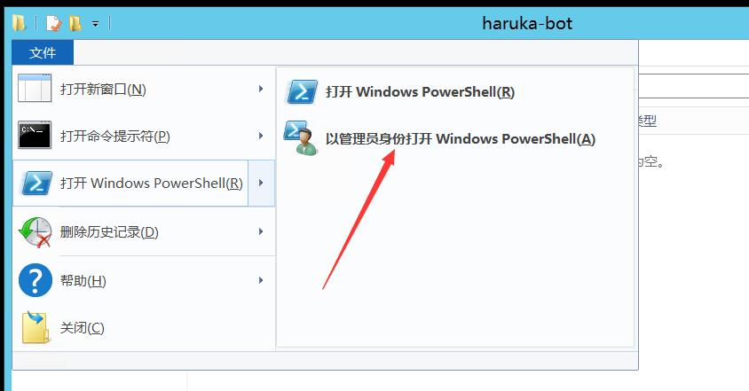
2. 在弹出的蓝色框框内输入 `pip install haruka-bot` 回车，出现下图画面即安装**本项目**成功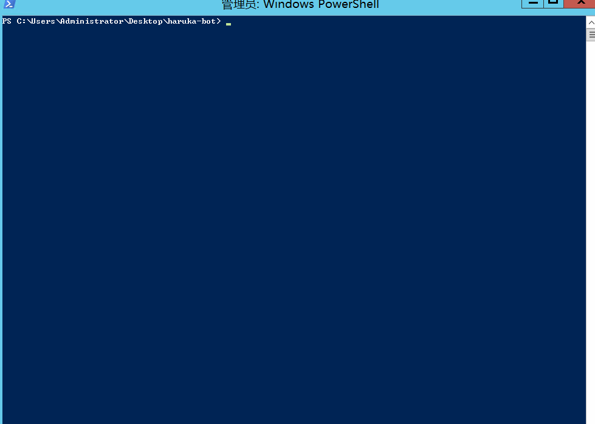
3. 关闭步骤2的窗口，重复步骤1，在弹出的蓝色框框内输入 `hb run` 回车，将会提示**输入主人QQ号**，在此处输入你本人的QQ**大号**，若是有其他共同管理的人员，请使用空格分开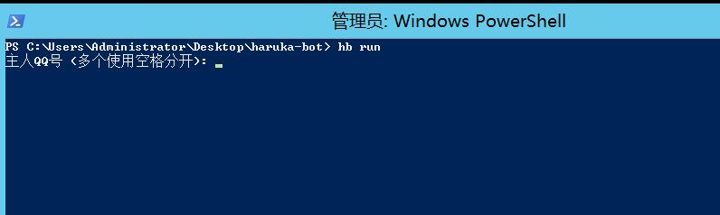

> 主人QQ号（多个使用空格分开）：10010 10086 10000

4. 在第三步完成后，hb会自动下载chromium，经过一段下载的进度条后，hb会自动启动，启动后若go-cqhttp配置没有问题，下方将提示小号QQ号连接成功，同时go-cqhttp停止滚动报错
5. 至此，hb已经成功安装并成功与go-cqhttp连接成功，现在向它发送 `帮助` 开始使用吧！

::: warning 注意

群里使用命令前需要 @机器人，如 `@HarukaBot 帮助`

:::

::: tip 发了帮助没反应？

帮助菜单属于长文本消息，可能遭到了 tx 风控。具体请查看 [机器人不发消息也没反应](../usage/faq.md#机器人不发消息也没反应)。

:::

如果对功能内容有疑问可以查阅 [功能列表](../usage/) 。

若是嫌使用命令前需要 @机器人 太过繁琐，或想修改存储dir，可以查看[进阶配置](../usage/settings.md)

## 4.4 圆满完成！

我相信，有耐心看到这里的同学，都是兼具好奇心和行动力的学习派！我现在要郑重的恭喜你，因为到了这里，你已经完完整整的【**从购买服务器开始，完成了Harukabot的部署**】了！这毫无疑问是一个巨大的胜利！

我相信，你现在一定对自行部署不再恐惧了吧！

**至此，小小白白话文圆满结束！** ⬛⬛⬛⬛ **100%**